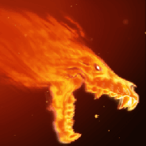
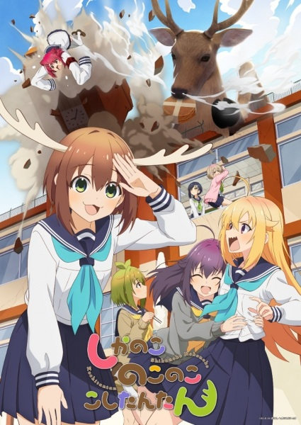
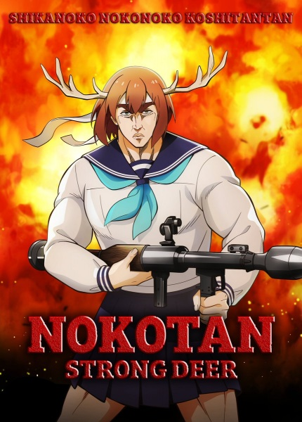
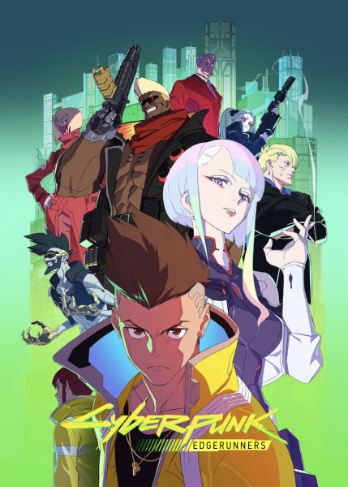
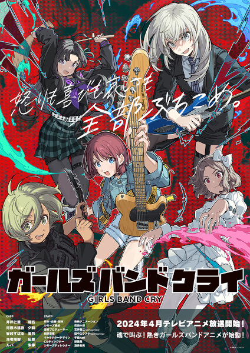
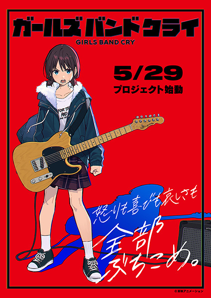
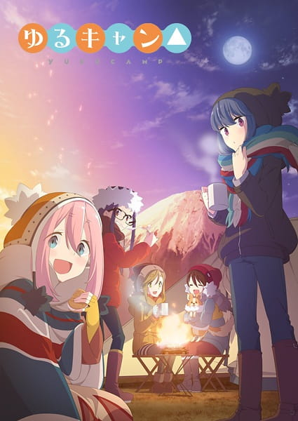
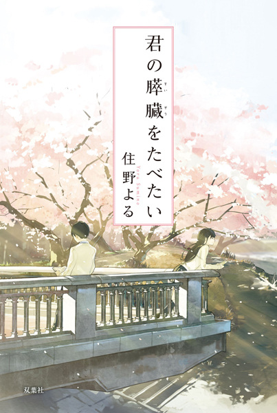
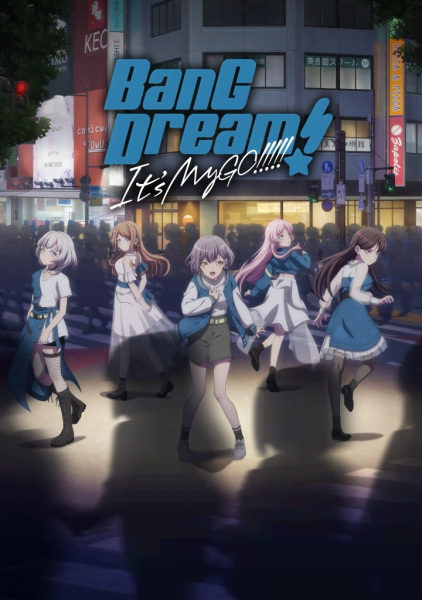

###     

<!---->

I am a passionate **Geophysics Enthusiast** currently majoring in **Exploration Technology and Engineering (Exploration Geophysics)** at **China University of Geosciences (Wuhan)**. Currently researching and diving deep in the study and innovation of **microseismic research** and **exploration**.

- 🔭 **Current Focus:** **Microseismic Monitoring** and **AI-driven Seismic Data Processing**.
- 🌱 **Learning & Growing:** Always expanding my skillset, with a current focus on **Machine Learning** and **Distributed Acoustic Sensing**.
- 📝 **Blog:** [RaySong's Geological Insights](https://www.RaySong513.github.io) - Sharing knowledge, tips, and discoveries in geophysics.
- 🎥 **Bilibili:** [My Bilibili Space](https://space.bilibili.com/27228095) - Where science meets creativity!
- 📫 **Reach Out:** Feel free to drop me a line at **songjinglei@cug.edu.cn**.

---

 **Let's Connect:** Whether you're into geophysics, machine learning, or just want to chat, I'm always open to new collaborations and discussions. Let's push the boundaries of what's possible together!

---

### 🛠️ My Tech Stack

---

### 🏆 GitHub Trophies

<!--https://github-profile-trophy.vercel.app/?username=RaySong513&theme=onedark-->
<!--https://github-profile-trophy.vercel.app/?username=ryo-ma&theme=buddhism-->
<!--https://github-profile-trophy.vercel.app/?username=ryo-ma&theme=juicyfresh-->
<!--https://github-profile-trophy.vercel.app/?username=ryo-ma&theme=gruvbox-->

  

---

###  **Favorite Anime**

  
  
  
  
  
  
  
  
  
  
  

